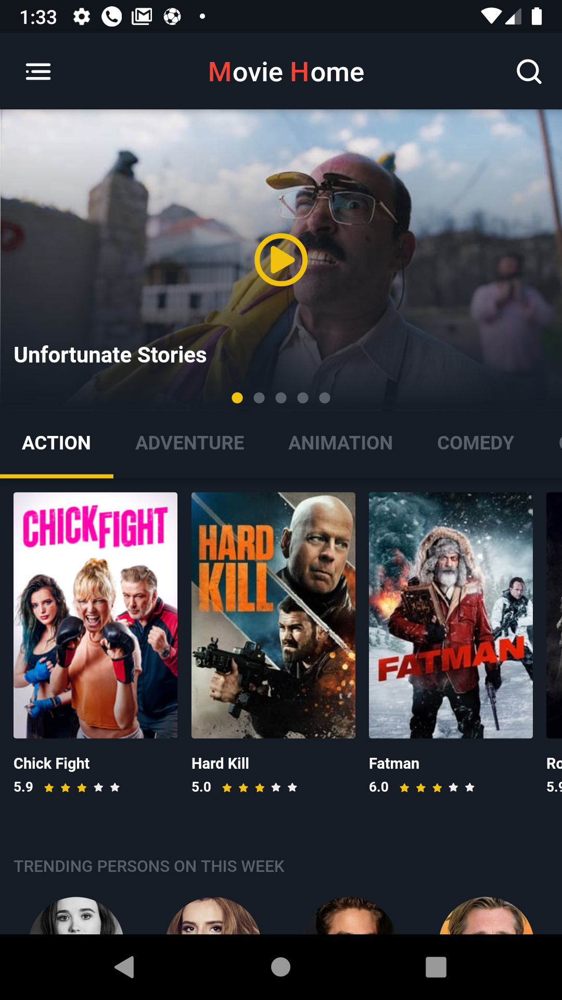
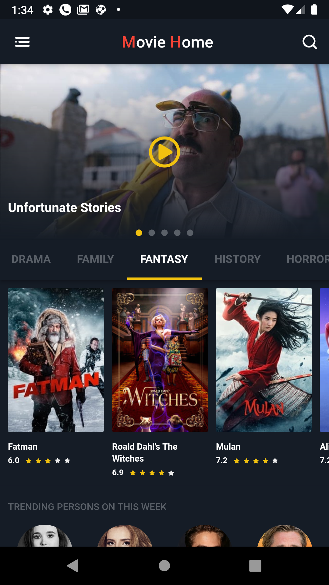
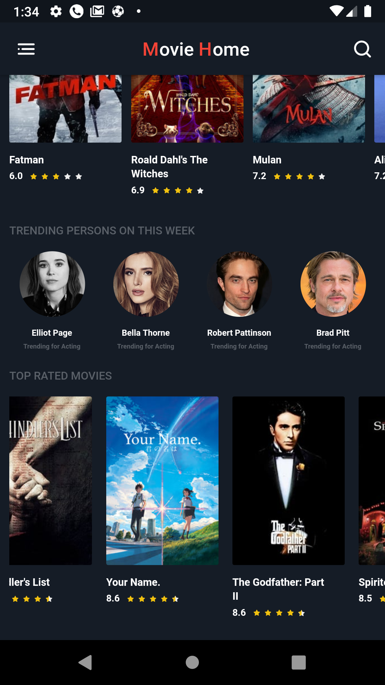
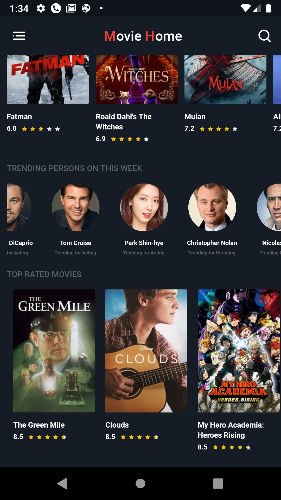
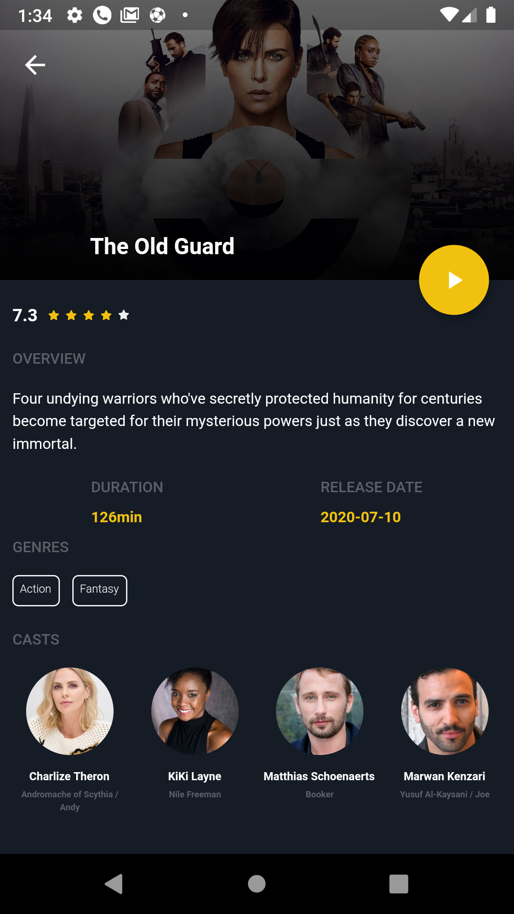

# Movie Home

This is a Movie Home App Using REST-API

# Tools
- State Management & Bloc
- Bloc Design Pattern
- RxDart
- The Movie Database API (IMDB)
- Eva Icons 
- Rating Bar
- Page Indicator
- Font Awesome

# Features
- Connecting With Database
- Retrieve Data From Database 
- Interacting With JSON API
- Ability to Play Videos of Movies' Trailers By Using Youtube Player
- Show Categories of Movies By Genres + Trending Persons on This Week + Top Rated Movies
- Show Details of Each Movie Including Rating + Genres + Duration + Release Date + Casts + Similar Movies

# Screenshots 
There are Some Screenshots to Show How My App Looks. Open Screenshots Folder To See More Pictures

